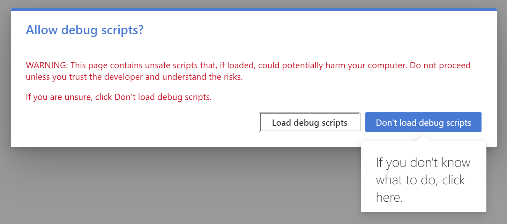
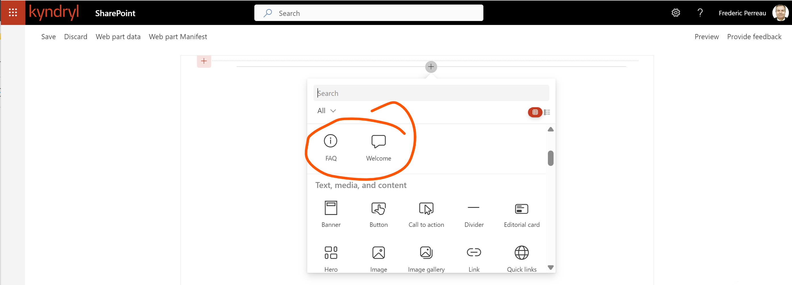
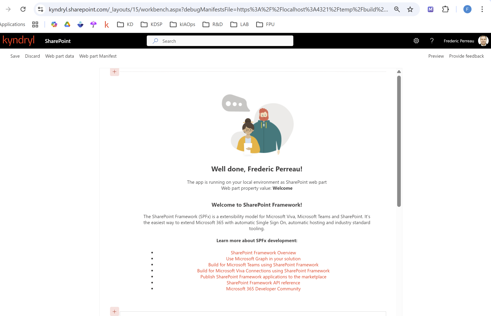
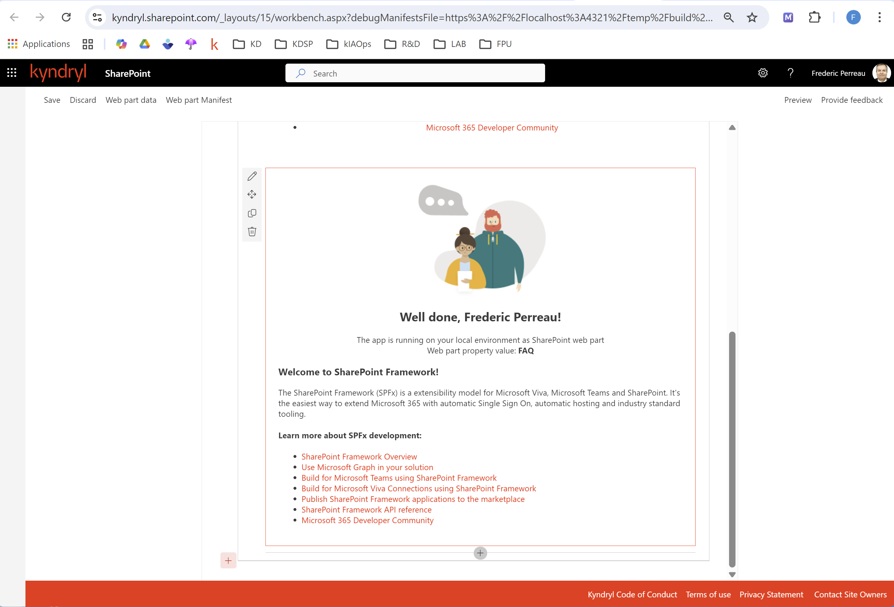

# SPFx-WebParts SharePoint project

[TOC]

## Introduction

Cet article se compose de deux parties, vous permet dans:

- un premier temps, **d'installer les outils** nécessaires à la mise en œuvre **d'un environnement de développement de WebParts SharePoint** sous Windows;
- un second temps la création **d'un exemple de projet WebPart** utilisé avec l'IDE **vsCode** afin de vous aider lors de **vos développements en JavaScript** et de **vos packaging SPFx** SharePoint.

## Partie 1 - Déploiement des outils basic & SPFx

### Installez le packaging Chocolatey - Administrateur mode

>:bulb: **Note:**  Consulter la documentation officielle de Chocolatey pour l'installation en mode administrateur : [Chocolatey Admin Installation](https://chocolatey.org/install#installing-chocolatey)

```powershell
Get-ExecutionPolicy
Set-ExecutionPolicy Bypass -Scope Process -Force; [System.Net.ServicePointManager]::SecurityProtocol = [System.Net.ServicePointManager]::SecurityProtocol -bor 3072; iex ((New-Object System.Net.WebClient).DownloadString('https://community.chocolatey.org/install.ps1'))
```

### Installez le packaging Chocolatey - Non-Administrateur mode

> :bulb: **Note:**  Consulter la documentation officielle de Chocolatey pour l'installation en mode non-administrateur : [Chocolatey Non-Admin Installation](https://chocolatey.org/install#non-admin)

```powershell
$InstallDir='C:\ProgramData\chocoportable'
$env:ChocolateyInstall="$InstallDir"

# If your PowerShell Execution policy is restrictive, you may
# not be able to get around that. Try setting your session to
# Bypass.
Set-ExecutionPolicy Bypass -Scope Process -Force;

# All install options - offline, proxy, etc at
# https://chocolatey.org/install
iex ((New-Object System.Net.WebClient).DownloadString('https://community.chocolatey.org/install.ps1'))
```

### Contrôlez l'installation de Chocolatey

Controlez la version de Chocolatey pour vérifier que l'installation s'est déroulée correctement.
Installez Fast Node Manager (fnm) pour gérer les différentes versions de NodeJS, ce qui est essentiel pour le développement SPFx.

```powershell
## Check the Chocolatey version
choco --version

## Install Fast Node Manager (fnm) for manage NodeJS versions
choco install fnm
```

### Installez le serveur NodeJS version 22 pour SFpx 1.21, 1.22

Utilisez fnm pour installer la version 22 de NodeJS, qui est compatible avec SPFx.

```powershell
fnm install v22.22.0
fnm list
fnm use v22.22.0
```

### Iniitalisez le répertoire de travail Visual Studo Code

Créez un répertoire de travail pour votre projet SPFx et ouvrez-le dans Visual Studio Code, ce qui vous permettra de commencer à développer vos WebParts SharePoint.
> :memo: **Note:** Créez le répertoire du projet vsCode "SFPx-WebParts et ouvrez-le dans Visual Studio Code, puis ouvrez un terminal PowerShell dans vsCode pour les étapes suivantes.

Ajoutez le répertoire de travail : "webparts"

```powershell
mkdir webparts
cd webparts
```

### Crééz votre Profile Utilisateur pour l'environement de développement SPFx

Crétation d'un profil utilisateur PowerShell pour le développement SPFx, ce qui permet de personnaliser l'environnement de développement et d'ajouter des alias ou des fonctions spécifiques à SPFx.

```powershell
if (-not (Test-Path $profile)) { New-Item $profile -Force }
```

Ajouter la ligne suivante à votre profil PowerShell pour ajouter un alias pour la commande de création de projet SPFx.

>:bulb: **Add line:** "fnm env --use-on-cd --shell powershell | Out-String | Invoke-Expression"

```powershell
Invoke-Item $profile
```

### Controlez les outils de base

```powershell
node --version
npm --version
```

### Installez maintenant les outils de développement SPFx

Installez Heft, Yeoman et le générateur SPFx pour créer des projets WebPart SharePoint (version 1.22).

```powershell
npm install --global @rushstack/heft yo @microsoft/generator-sharepoint
```

> :warning: **Warning:**  Ne pas vous inquiéter pour les warning (low, moderate, high) !

```powershell
yo 
# puis quittez le générateur Yeoman en tapant "q" ou "Ctrl + C"

     _-----_     ╭───────────────────────╮
    |       |    │      Bye from us!     │
    |--(o)--|    │       Chat soon.      │
   `---------´   │      Yeoman team      │
    ( _´U`_ )    │    http://yeoman.io   │
    /___A___\   /╰───────────────────────╯
     |  ~  |
   __'.___.'__
 ´   `  |° ´ Y `

```

### Installez l'extension SPFx pour Visual Studio Code

Installez l'extension **SharePoint Embedded** pour Visual Studio Code, qui offre des fonctionnalités spécifiques pour le développement SPFx, telles que la création de projets, la génération de code et le déploiement.

## Partie 2 - Création d'un projet WebPart

### Créez un projet WebParts SharePoint avec Yeoman

Créez un projet WebPart SharePoint en utilisant Yeoman, qui vous guidera à travers les étapes de configuration du projet, telles que le choix du framework (React, No JavaScript Framework, etc.) et la configuration des options de projet.

Créez un premier wbepart "welcome" dans un projet "webparts" avec le framework React.
> :bulb: **Note:** projet "webparts", webpart: "welcome", framework: "React"

Créez un second webpart "FAQ" dans le même projet "webparts" avec le framework "React".
> :bulb:**Note:** projet "webparts", webpart: "FAQ", framework: "React"

```powershell
yo @microsoft/sharepoint --global

      _=+#####!
   ###########|       .--------------------------------------.
   ###/    (##|(@)    |           Congratulations!           |
   ###  ######|   \   |     Solution webparts is created.    |
   ###/   /###|   (@) |  Run npm run start to play with it!  |
   #######  ##|   /   '--------------------------------------'
   ###     /##|(@)
   ###########|
      **=+####!


     _-----_     ╭───────────────────────╮
    |       |    │      Bye from us!     │
    |--(o)--|    │       Chat soon.      │
   `---------´   │      Yeoman team      │
    ( _´U`_ )    │    http://yeoman.io   │
    /___A___\   /╰───────────────────────╯
     |  ~  |
   __'.___.'__
 ´   `  |° ´ Y `
```

### Ajoutez les Certificats de développement pour le projet SPFx

Ajoutez les certificats de développement pour le projet SPFx, ce qui permet de tester et de déployer les WebParts localement.

```powershell
heft trust-dev-cert
```

### Modifiez le tenant SharePoint pour le développement local

Remplacez la variable "**{tenantDomain}**" dans le fichier "**serve.json**" par le nom de votre tenant SharePoint, ce qui permet de servir les WebParts localement et de les tester dans votre environnement SharePoint.

>:bulb:**Note:** Pour Kyndryl, il s'agit de "kyndryl.sharepoint.com"

### Modifiez les Manifests des WebParts - Welcome, FAQ

Dans vsCode, modifiez les fichiers de manifeste "./src/webparts/[welcome|faq]/[Welcome|Faq]Webpart.manifest.json" de chaque WebPart : "Welcome" et "FAQ" pour personnaliser la propriété "officeFabricIconFontName".

- **Welcome:**  "officeFabricIconFontName":"**Comment**" à la place de "Page"
- **FAQ :**   "officeFabricIconFontName":"**Info**" à la place de "Page"

Ce changement d'icone vous permet de distinguer plus facilement vos WebParts dans l'interface utilisateur de SharePoint.

### Lancez le serveur de développement pour testez vos WebParts

Lancez le serveur de développement pour tester les WebParts localement, ce qui vous permet de voir les changements en temps réel et de déboguer votre code.

```powershell
heft start
```

Après le lancement du serveur de développement, vous devriez voir une sortie similaire à celle-ci dans votre terminal, indiquant que le serveur est en cours d'exécution et que les WebParts sont disponibles pour les tests locaux.

```console
[build:set-browserslist-ignore-old-data-env-var] Setting environment variable BROWSERSLIST_IGNORE_OLD_DATA=1
[build:sass] Generating sass typings...
[build:copy-javascript] Copied 4 files and linked 0 files
[build:sass] Generated sass typings
...
[build:webpack] Starting webpack-dev-server
<i> [webpack-dev-server] Project is running at:
<i> [webpack-dev-server] Loopback: https://localhost:4321/, https://[::1]:4321/
[build:webpack] Started Webpack Dev Server at https://[::1]:4321/
[build:webpack] Running incremental Webpack compilation
[build:configure-webpack-serve] 
[build:configure-webpack-serve]  ═════════════════════════════════════════════════════════════════════
[build:configure-webpack-serve]  To load your scripts, use this query string:
[build:configure-webpack-serve]  ?debugManifestsFile=https://localhost:4321/temp/build/manifests.js&debug=true&noredir=true
[build:configure-webpack-serve]  ═════════════════════════════════════════════════════════════════════
[build:configure-webpack-serve] 
webpack 5.95.0 compiled successfully in 6096 ms
 ---- build finished (36.679s) ---- 
-------------------- Finished (36.685s) --------------------
Waiting for changes. Press CTRL + C to exit...
```

Puis votre navigateur par défaut devrait s'ouvrir automatiquement avec l'URL de test local, où vous pourrez voir et interagir avec vos WebParts "Welcome" et "FAQ" dans l'environnement de développement SharePoint.

## A vous de jouez ...

### Ne pas charger les scripts de débogage



### Ajoutez vos deux premières Webparts



### Ajoutez votre WebPart "Welcome"



### Ajoutez aussi votre WebPart "FAQ"




<p style="color:blue;text-align:center;font-size:32px;">The End!</p>
